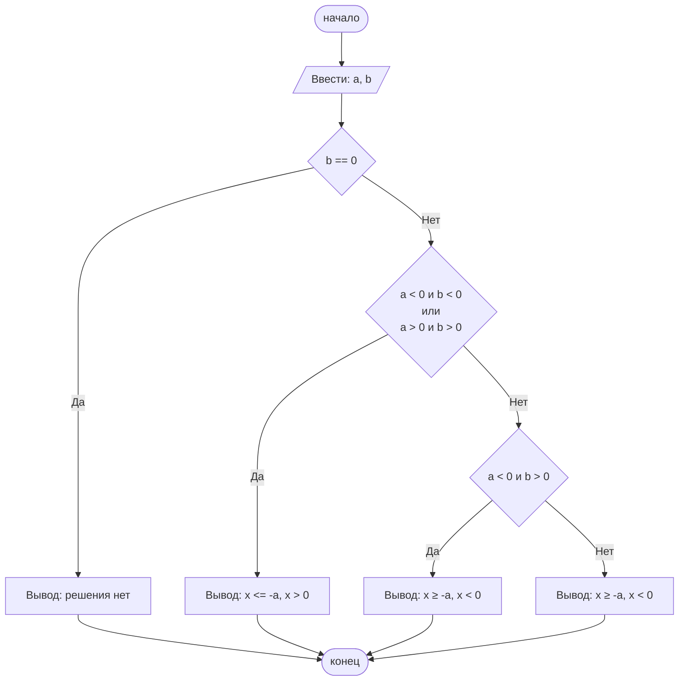

#### `№ группы:` ПМ-2501


#### `Выполнила:` Ефремова Анастасия Александровна


#### `Вариант`: 6


## Cодержание:

1. [Постановка задачи](#постановка-задачи)

2. [Входные и выходные данные](#входные-и-выходные-данные)

3. [Выбор структуры данных](#входные-и-выходные-данные)

4. [Алгоритм](#алгоритм)

5. [Программа](#программа)

6. [Анализ правильности решения](#анализ-правильности-решения)


## Постановка задачи

Программа получает на вход 2 числа а и b. Нужно решить неравенство $$\frac{(х + а)}{bx} \geq 0$$ относительно х.


## Входные и выходные данные

**Данные на вход**

На вход программа должна получать 2 числа, при этом в условии не сказано, к какому множеству принадлежат получаемые числа, поэтому будем считать их целыми.

**Данные на выход**

Так как программа должна вывести промежуток значений х, то на выход мы получим двойное неравенства, состоящее из целых чисел.


## Выбор структуры данных

Программа получает 2 целых числа, находящихся в промежутке от -2^31 до (2^31 - 1). Поэтому для их хранения использую тип данных int.


## Алгоритм

Алгоритм выполнения программы:


**Ввод данных:**

Программа считывает два целых числа, обозначенные как а и b.


**Анализ неравенства:**

Подставив разные пары чисел на место а и b можем заметить закономерность решений. 

В числителе значение параметра а принимает противоположное значение (введем для него новую переменную с). 

  

Далее рассмотрим все возможные значения переменных а и b:

- a > 0, b > 0 – в таком случае решением будет промежуток x <= (-a) and x > 0

- a > 0, b < 0 – таком случае решением будет промежуток x >= (-a) and x < 0

- a < 0, b > 0 – в таком случае решением будет промежуток x >= (-a) and x < 0

- a < 0, b < 0 – в таком случае решением будет промежуток x <= (-a) and x > 0


**Вывод результата:**

На экран выводится решение в виде двойного неравенства.


## Блок-схема



## Программа

```java

import java.util.Scanner;

public class лабораторная {
    public static void main(String[] args) {
        // Объявляем объект класса Scanner для ввода данных
        Scanner in = new Scanner(System.in);
        // Считываем с клавиатуры два целых числа
        int a = in.nextInt();
        int b = in.nextInt();
        int c = a * (-1);
        if (b==0)
            System.out.println("Решения нет");
        else
        if ((a < 0 && b < 0) || (a > 0 && b > 0))  {
            System.out.println("x <= " + "" + c + " "+ "and" + " "  + "x > 0");
        } else {
            if (a < 0 && b > 0) {
                System.out.println("x >= " + "" + c + " "+ "and" + " "  + "x < 0");
            } else {
                System.out.println("x >= " + "" + c + " "+ "and" + " "  + "x < 0");
            }
        }
    }
}
```


## Анализ правильности решения

Input:

3

2

Output:

x <= -3 and x > 0

Input:

3

-2

Output:

x >= -3 and x < 0

Input:

-3

2

Output:

x >= 3 and x < 0

Input:

-3

-2

Output:

x <= 3 and x > 0

Input:

0

0

Output:

Решения нет